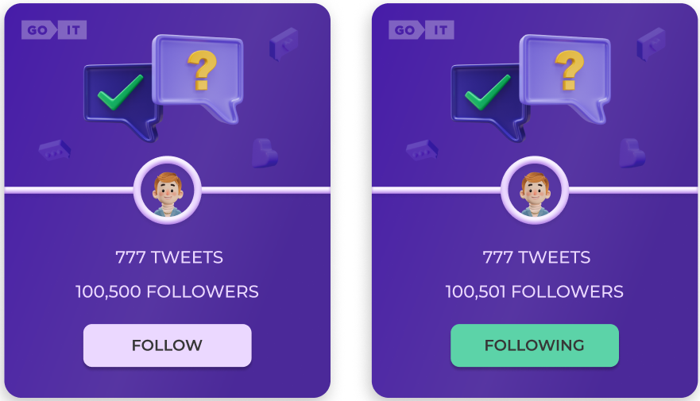

# tweets-cards

## Technical task

1. According to the layout, you need to implement user cards.
2. When you click on the Follow button, the text changes to Following. The color of the button also changes. And yours is added to the number of followers. That is, the initial number is 100,500 followers. When you click on the button, it will be 100,501.
3. When the page is updated, the final result of the user's actions should be recorded. That is, if you click on the button and refresh the page, the button still remains in the Following state with the appropriate color, and the number of followers does NOT decrease to the initial value.
4. When you click the button again, its text and color change to their original state. The number of followers also changes. It decreases by 1 (100,500).
5. In the code, the number 100,500 must be written with one value (100500). In the UI, it is displayed with a comma (100,500).
6. Create routing using React Router. The application must have the following routes. If the user entered by a non-existent route, he must be redirected to the home page. '/' – Home component, home page. Styling and design at your discretion '/tweets' - component tweets, page with display of tweets The tweets page should have a Back button that leads to the main page.
7. Add filtering. It should be a Dropdown with 3 options (design at your discretion): show all, follow, followings show all - show all tweets. follow - show tweets with follow status. followings - show tweets with following status

Create your personal backend for development using the mockapi.io UI service. Create the users resource. Use the resource constructor and describe the user object.

## The technology stack that was used

1. React
2. React-router-dom
3. React-loader-spinner
4. React-scroll-up
5. React-icons
6. React-hot-toast
7. Axios
8. Styled-components
